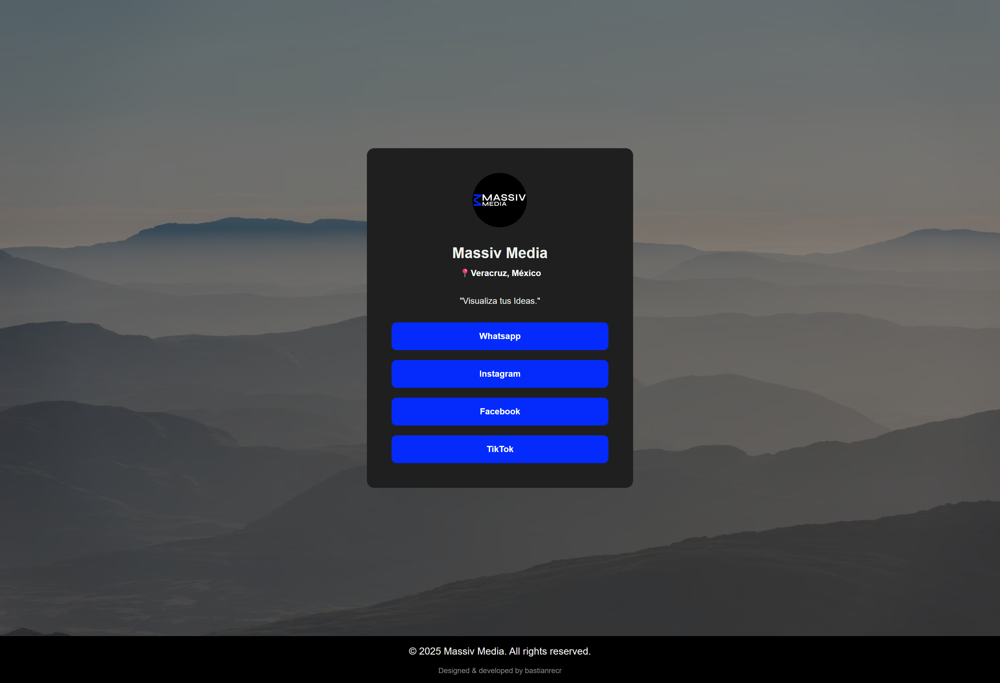

# Massiv Media - Personal Project

This is a personal freelance-style project built for my own audiovisual and filmmaking company, **Massiv Media**. While it currently functions as a digital business card with social media links, it is designed as a scalable foundation for future development. In upcoming versions, this site will evolve into a dynamic portfolio platform with user authentication, admin content uploads, and a content management system tailored to our brand's needs.

## Table of contents

- [Overview](#overview)

  - [The challenge](#the-challenge)
  - [Screenshot](#screenshot)
  - [Links](#links)

- [My process](#my-process)

  - [Built with](#built-with)
  - [What I learned](#what-i-learned)
  - [Continued development](#continued-development)
  - [Useful resources](#useful-resources)

- [Author](#author)
- [Acknowledgments](#acknowledgments)

## Overview

> 🗣️ _Nota: Este proyecto está desarrollado en español, ya que Massiv Media está localizada en Veracruz, México. Sin embargo, como desarrollador bilingüe, tengo la visión de expandir tanto mis servicios como los de mi empresa a audiencias internacionales en el futuro._

> Translation: This project is built in Spanish, as Massiv Media is based in Veracruz, Mexico. However, as a bilingual developer, I aim to expand both my services and my company's reach to international audiences in the near future.

### The challenge

The goal of this project was to:

- Create a minimal, mobile-friendly landing page that acts as a digital entry point for Massiv Media.
- Include branded visuals, a recognizable aesthetic, and links to the most important social media platforms.
- Prepare a scalable codebase for adding future features such as user authentication, media uploads, and admin content management.
- Use semantic HTML and modular CSS with the BEM methodology for maintainability and reusability.

### Screenshot



### Links

- Repository URL: [GitHub Repository](https://github.com/bastianrecr/massiv-media)
- Live Site URL: [massiv-media.netlify.app](https://massiv-media.netlify.app/)

## My process

### Built with

- Semantic HTML5
- CSS custom properties
- Flexbox and Grid layout
- Mobile-first responsive design
- BEM (Block Element Modifier) methodology
- JavaScript ES6 Modules
- Visual Studio Code

### What I learned

- **BEM methodology**: This was my first freelance-style project where I fully applied BEM. It helped me keep the structure modular and scalable.
- **Modular JavaScript**: I created modules for individual blocks, like the Footer, which handles dynamic behaviors like updating the current year.
- **Planning for scalability**: Even though the site is simple now, I practiced setting up the file structure and code with future expansion in mind.

```js
// Example: Footer module that updates the copyright year
const yearSpan = document.getElementById("year");
const currentYear = new Date().getFullYear();
yearSpan.textContent = currentYear;
```

### Continued development

In future versions of this site, I plan to:

- Add user authentication (probably with Firebase or Auth0).
- Enable admin uploads to showcase completed projects, reels, and portfolios without updating the code manually.
- Include a CMS-like interface to manage posts or video content.
- Improve accessibility and add language support for English.

### Useful resources

- [BEM Methodology Guide](http://getbem.com/)
- [MDN Web Docs](https://developer.mozilla.org/)
- [Frontend Mentor Community](https://www.frontendmentor.io/) – Inspiration for structure and approach.
- [CSS Tricks Flexbox Guide](https://css-tricks.com/snippets/css/a-guide-to-flexbox/)

## Author

- Website - [bastianrecr.github.io](https://bastianrecr.github.io)
- Frontend Mentor - [@bastianrecr](https://www.frontendmentor.io/profile/bastianrecr)
- GitHub - [@bastianrecr](https://github.com/bastianrecr)

## Acknowledgments

Big thanks to the creators and educators behind resources like Frontend Mentor, Codecademy, TripleTen and MDN that guided my learning journey. Also, shoutout to my filmmaking partner for inspiring the branding and creative direction of this project.
